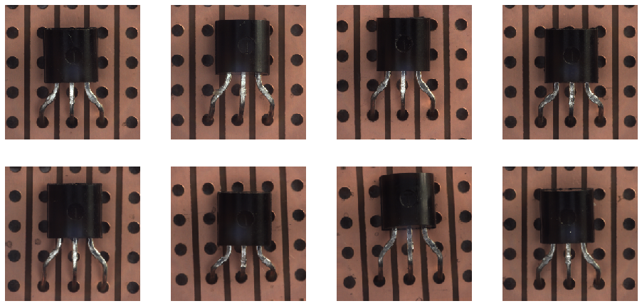

# Anomaly Detection in transistor images with Convolutional Autoencoder

*Note: The notebook was executed in Google Colab to reduce training time of the deep learning model.*

## Project Objective

Anomaly detection techniques are used in various application areas such as fraud detection, intrusion detection as well as industrial damage detection. For the latter, the fault detection for mechanical units but also the structural damage detection such as cracks in product surfaces is possible. The detection of anomalies in structures, textures and objects are widely carried out by using images. The project objective is to **detect anomalies in transistor images** with an autoencoder.

## Results

Throughout this project, two different anomaly detection techniques were compared which include anomaly detection based on the latent space of the autoencoder and anomaly detection based on a distance measure between normal and reconstructed images. Based on the latent space, the models One-Class SVM, Isolation Forest and Local Outlier Factory are used. The mean squared error (MSE) is used for the distance measure by using the trained autoencoder.

The results are measured by the accuracy and are as follows:

- One Class SVM: 0.72 (good images), 0.68 (anomaly images)
- Isolation Forest: 1.0 (good images), 0.23 (anomaly images)
- Local Outlier Factory: 0.90 (good images), 0.60 (anomaly images)
- **Autoencoder MSE: 0.95 (good images), 0.63 (anomaly images)**

## Limitations

The examined sample images of correct and incorrect detected anomaly images shows that especially the distance measure has issues by detecting simple surface damages and small deviations with respect to the transistor leads.

No hyperparameter tuning was conducted for the machine learning models such as the *IsolationForest*. The tuning of the hyperparameters can increase the model performance and could lead to better results than the used MSE.

With MSE a quite simple distance measure was used. More complex distance measures such as *Structural Similarity Index* (SSIM) can result into higher accuracy.

## Data

The project is based on a recently published real-world dataset which contains different texture and object categories with corresponding high-resolution color images. The dataset is freely available at [MVTec AD](https://www.mvtec.com/de/unternehmen/forschung/datasets/mvtec-ad/) and structured in 15 single textures and objects. For each texture and object, there exist different anomaly types such as cracks and damaged cases.

The experiments were conducted on the "Transistor" object which consists of 213 good images for training and 60 good images as well as 40 defective images for testing. The format of each image is provided as png with height=1024, width=1024 and 24 bit depth. As deep learning usually requires a lot of data, the training dataset is extended to 2897 good images by applying data augmentation (image generation).

